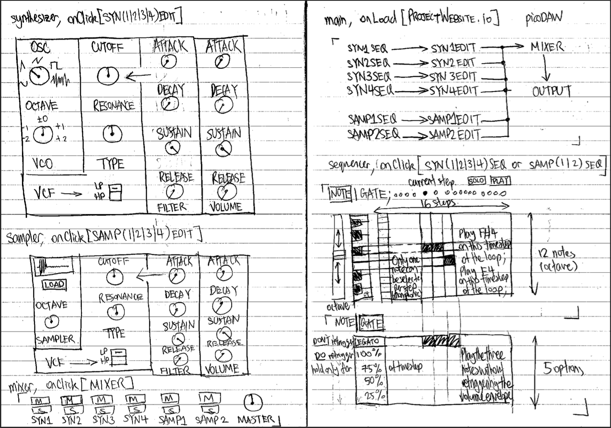

# picoDAW

goto [HERE](https://hourlilies.github.io/elec5305-project-550790019/build-web-wasm/) to try out latest release

goto [HERE](https://github.com/hourlilies/elec5305-project-550790019) to see repo and source code

goto [HERE](https://github.com/hourlilies/elec5305-project-550790019/blob/master/Proposal/main.pdf) to read project proposal

## aim

build a sequencer/synthesizer/sampler modelled after the korg ds-10, deployed onto the web

## instructions

uses the [iplug2](https://github.com/iplug2/iplug2) library; download it, and replace `Examples/IPlugInstrument` with the contents of this repository

then, `cd` into `iplug2/Examples/IPlugInstrument/scripts` and run `makedist-wasm.sh`

the resulting folder at `iplug2/Examples/IPlugInstrument/build-web-wasm` contains the web application

serve it via a http server of choice; a python3 `server.py` is provided in the same folder to host it locally

the link to latest release provided [HERE](https://hourlilies.github.io/elec5305-project-550790019/build-web-wasm/) 
is deployed through github pages