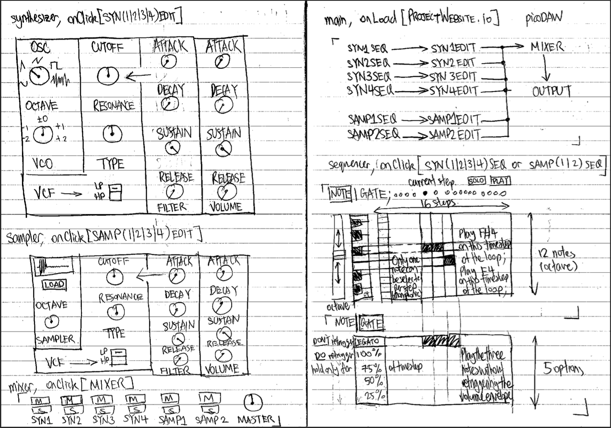

# picoDAW

goto [HERE](https://fanchenhao2206.github.io/elec5305-project-550790019) for project site

goto [HERE](https://fanchenhao2206.github.io/elec5305-project-550790019/picoDAW/build-web-wasm/) to try out latest release

goto [HERE](https://github.com/fanchenhao2206/elec5305-project-550790019) to see repo and source code

goto [HERE](https://github.com/fanchenhao2206/elec5305-project-550790019/blob/master/Proposal/main.pdf) to read project proposal

## aim

build a sequencer/synthesizer/sampler modelled after the korg ds-10, deployed onto the web

## instructions

uses the [iplug2](https://github.com/iplug2/iplug2) library; download it by running `git submodule update --init --recursive`

then, `cd` into `picoDAW/scripts` and run `makedist-wasm.sh`

the resulting folder at `picoDAW/build-web-wasm` contains the web application

serve it via a http server of choice; a python3 `server.py` is provided in the same folder to host it locally

the link to latest release provided [HERE](https://fanchenhao2206.github.io/elec5305-project-550790019/picoDAW/build-web-wasm/) 
is deployed through github pages

## project feedback two

### call...

Hi ELEC5305 Team,

The first round of feedback suggested a minimum system consisting of:

- One working synthesizer engine with several oscillator waveforms;
- An amplitude ADSR envelope;
- An adjustable resonant low-pass/high-pass filter;
- One simple sampler;
- A 16-step sequencer;
- A basic mixer.

Unfortunately, understanding the existing iPlug2 codebase, particularly the included IPlugInstrument example, took longer than expected, resulting in a slower initial start to development. However, development has accelerated considerably over the past two weeks, with all features in the current build having been implemented during this period.

I therefore expect to complete the remaining features, including additional oscillator waveforms and the adjustable resonant low-pass/high-pass filter, within the allotted time for this project. And, as highlighted in the first round of feedback, these will also allow me to investigate oscillator aliasing and evaluate established anti-aliasing techniques, alongside examining and validating the behaviour of the resonant filter.

The 16-step sequencer is also already working really well---with legato settings too---and the current build also provides the foundation for supporting multiple instances of each synthesizer engine. This establishes the intended architecture for combining multiple instruments with the sequencer.

With the initial challenges of understanding the existing framework largely overcome and development progressing more rapidly, I am confident in continuing towards the planned system while incorporating the DSP investigations outlined in the original feedback.

See below for a short video of the current picoDAW working in action. 

Watch the short video [HERE](https://www.youtube.com/watch?v=PCjW_U7Rkx0).

Furthermore, you can try out the app yourself through the latest (hopefully stable) release [HERE](https://fanchenhao2206.github.io/elec5305-project-550790019/picoDAW/build-web-wasm/).

### ...and response 

HELLO WORLD

## project feedback one

### call...

Hi ELEC5305 Team,

This project aims to develop a music sequencer with a synthesizer and sampler as available instruments, 
for any device capable of 
running a modern web browser supporting WebAudio, using the emscripten compiler toolchain that 
turns C++ DSP code into WebAssembly. 

The goal is to make music production more accessible; pretty much any computer---whether that 
be a smartphone, laptop, or even a single-board computer---can run a modern web browser that supports 
WebAudio. This is important because anyone should be able to play with and make music, without needing to 
install and learn a comprehensive desktop-based music production application designed 
for professionals and not the general public.

(See proposal [HERE](https://github.com/fanchenhao2206/elec5305-project-550790019/blob/master/Proposal/main.pdf) for more detail...)

Of course, the ultimate deliverable will be a working prototype of picoDAW deployed onto the 
provided GitHub project site. Given the complexity of a DAW however---even a stripped down 
one, only a sequencer/synthesizer/sampler---the core mantra behind the project will be to 
keep it simple, stupid. 

This means, the UI will be basic without the polish of the actual 
DS-10 it'll take inspiration from. Furthermore, though audio effects like real-time reverb 
or delay, and features like a semi-modular patchbay, are incredibly useful in modern music 
creation, they will not be prioritised over a working prototype.

What is a non-negotiable 
though, is the inclusion of a low pass and high pass filter for each instrument, 
and an envelope to control its cutoff frequency; alongside a second envelope for volume.

Timeline
- Weeks 1-4: Consider project topic; research and literature review
- Weeks 5-6: Implement sequencer to trigger included sine synth wrt. volume envelope; on notes and following gate values
- Weeks 7-8: Setup testing framework; implement low-pass/high-pass filters with envelopes on their cutoff frequencies
- Weeks 9-10: Implement additional oscillators, sampler, and mixer; refactor system to maximise code reuse
- Weeks 11-13: Report writing; bug fixes, implementation of extra features if stretch goals are met, prototype cleanup

### ... and response

Hi Tim,

This is an interesting project and I like the idea of producing a working browser-based musical instrument as the final demonstration. The use of iPlug2, C++ and WebAssembly is also sensible because it means you are starting from an existing real-time audio framework rather than needing to build the complete audio infrastructure yourself.

I would, however, like to give the project a little more research and signal-processing structure. At present there is a risk that it becomes primarily a software-development project in which the main objective is to implement as many DAW features as possible. For ELEC5305, I would prefer the picoDAW itself to become the platform on which you investigate one interesting audio-DSP problem. You may be interested in what is being done with DDSP (mentioned down below).

> Make one DSP question central to the project. I suggest investigating aliasing in digital waveform synthesis. A possible research question is:

“How can a lightweight real-time digital synthesizer reduce oscillator aliasing while retaining sufficiently low computational complexity for browser-based implementation?”

This is particularly relevant because you plan to implement sawtooth, square and triangle oscillators. Straightforward digital implementations of sawtooth and square waves contain discontinuities and can generate substantial aliasing, particularly at higher musical pitches.

I suggest first implementing or demonstrating a simple/naive oscillator and then comparing it with an established alias-suppression technique such as PolyBLEP or differentiated polynomial waveforms (DPW).

> Start from the existing literature and existing implementations. You do not need to invent an anti-aliased oscillator algorithm yourself. Read the established literature on digital oscillator generation, understand one of the standard approaches, find an existing implementation where useful, reproduce it and then integrate/adapt it into your synthesizer.

Useful literature includes work by Välimäki and colleagues on antialiasing oscillators and virtual-analog synthesis, together with your existing references such as Zölzer's Digital Audio Effects and Zavalishin's The Art of VA Filter Design.

I would aim for around 7–10 meaningful references covering digital/subtractive synthesis, oscillator aliasing, digital resonant filters and real-time web audio. Your bibliography currently also contains some unrelated template references concerning blockchain and autonomous drones; please remove these and replace them with literature that is actually relevant to the project.

> Use the existing iPlug2 code as your baseline, but distinguish clearly between existing and new work. Using iPlug2 is absolutely appropriate and is exactly the kind of existing code layer I would encourage. However, the current DSP code still appears to contain much of the standard iPlug2 IPlugInstrument example, including the sine oscillator, ADSR, LFO and MIDI voice framework.

This is not a problem, but in your repository and final report please make it very clear which components were supplied by iPlug2, which components you modified, and which DSP algorithms you implemented yourself. The interesting work is what you build and investigate on top of the framework.

> Make the oscillator comparison quantitative. For example, generate sawtooth and square waves at several musical pitches ranging from low frequencies to high notes. Plot their spectra and identify the desired harmonic series and the components produced by aliasing.

Compare the naive and alias-suppressed versions using a simple quantitative measure of unwanted spectral energy, together with spectrogram/spectrum plots and listening examples. You should be able to explain the results directly using sampling theory and the Nyquist frequency.

This would give the project a strong connection to the signal-processing theory in ELEC5305 rather than simply judging whether the synthesizer “sounds good”.

> Keep the overall picoDAW implementation manageable. Your proposed system currently contains four synthesizers, two samplers, separate filters and envelopes for each instrument, a 16-step sequencer and a mixer. I would not make completion of all of these features equally important.

A good minimum system would be something like:

- one working synthesizer engine with several oscillator waveforms;
- amplitude ADSR;
- an adjustable resonant low/high-pass filter;
- one simple sampler;
- a 16-step sequencer;
- a basic mixer.

Once this architecture works, creating multiple instances of the same synthesizer/sampler engine may be straightforward. Additional oscillators, pattern sequencing, reverb, delay, more complex routing and other DAW features should remain extensions rather than taking time away from the DSP investigation.

> Treat the filter as a signal-processing component rather than simply another UI feature. Your proposed resonant low/high-pass filter with envelope-controlled cutoff is very relevant to subtractive synthesis. Please start from an established digital-filter design, understand the algorithm, and validate its behaviour.

For example, examine the measured frequency response for several cutoff and resonance values and check its behaviour when the cutoff frequency is modulated. The Zavalishin reference you have already identified is a useful starting point. This does not need to become another large research comparison; it is primarily about showing that the DSP behaves as intended.

> Use existing infrastructure for routine operations such as sample loading and sample-rate conversion. The sampler is a useful feature, but please do not spend a large proportion of the project implementing WAV decoding or a sophisticated sample-rate converter unless that becomes an explicit DSP investigation. Use existing library/browser functionality where appropriate and concentrate your effort on the audio-processing questions.

> It would be useful to include a small real-time performance evaluation. Since one of your motivations is that picoDAW should run in an ordinary web browser, test this rather than simply assuming it.

You might report the audio block size/latency and examine how the system behaves as the number of active voices increases. It would also be interesting to compare the computational cost of the naive and alias-suppressed oscillators. You do not need a comprehensive browser benchmark; a small experiment on perhaps a laptop and one mobile device would be enough.

> Briefly place the project in the context of modern neural audio synthesis. Traditional manually controlled synthesizers are no longer the only approach to generating audio. Modern systems include neural audio generation and approaches such as Differentiable Digital Signal Processing (DDSP), which combine conventional oscillators and filters with learned models.

You do not need to implement or train a neural synthesizer for this project. Your classical DSP approach is very appropriate for ELEC5305. However, your literature review should demonstrate that you understand how contemporary synthesis research has developed and why traditional DSP remains useful because of its low computational cost, interpretability and direct musical control.

A good overall project progression would therefore be:

Literature review and existing code → establish a minimal working picoDAW → implement a simple oscillator baseline → investigate and implement an alias-suppressed oscillator → quantitatively compare their spectra and computational cost → integrate the improved oscillator into picoDAW → validate the filter behaviour → optionally evaluate browser latency/performance and add additional DAW features.

Overall, I think this could become a very good and distinctive ELEC5305 project. I would keep the enjoyable goal of building a usable browser synthesizer/sequencer, but put considerably more emphasis on understanding and experimentally evaluating the DSP inside it rather than on maximising the number of software features.
